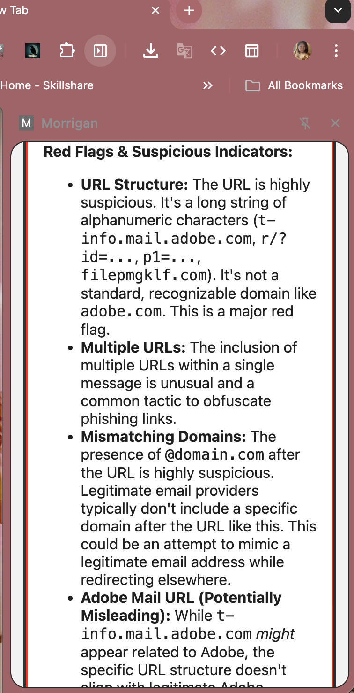
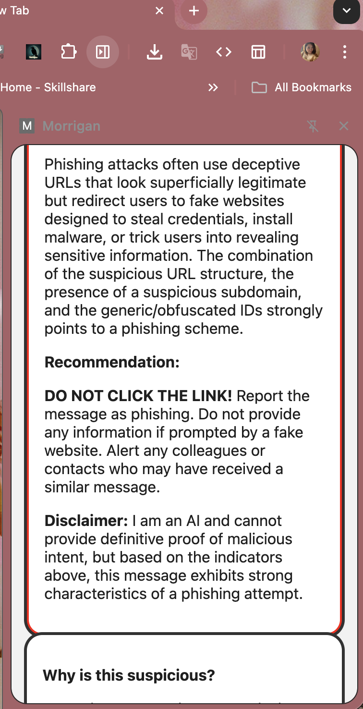
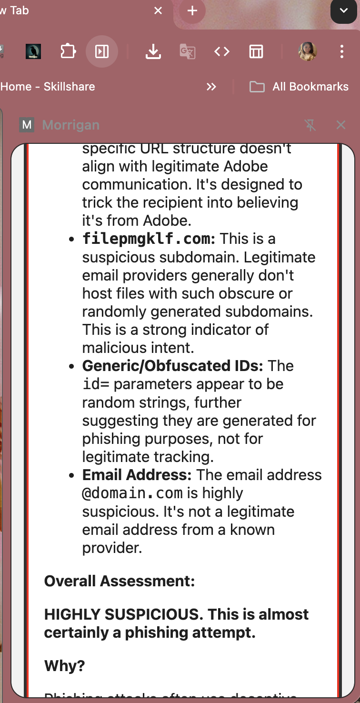
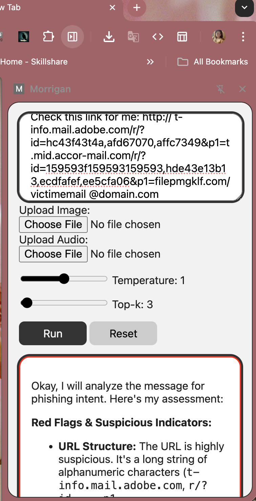
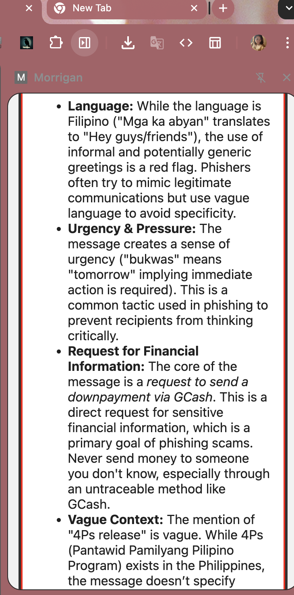
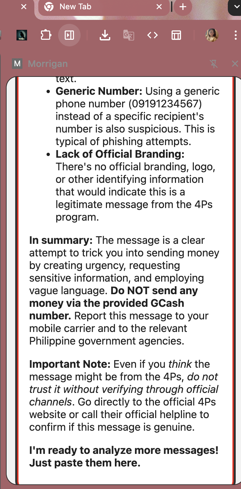
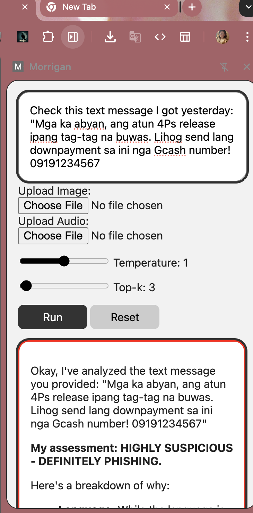

# Morrigan

**Morrigan** is a Chrome AI Built-in extension prototype powered by the **Prompt API** and **Gemini Nano**. It provides on-device AI capabilities for safer browsing, scam detection, and multimodal input handling.

## Features

- Prompt API integration for text-based tasks (summarization, rewriting, proofreading).
- Multimodal Prompt API support for screenshots of emails, chats, and recorded audio calls (.wav / .mp4).
- Scam call detection by analyzing uploaded audio recordings.
- URL legitimacy checks to flag phishing attempts.
- Spam bot detection for suspicious messages.
- Session management with `initialPrompts`, `AbortController`, and `localStorage`.
- Runs fully on-device with Gemini Nano for privacy and speed.
- **Localization support** — detects scams and phishing attempts written in Filipino languages including Tagalog and Hiligaynon, with contextual understanding of local scam patterns (e.g. GCash fraud, 4Ps impersonation).

## Screenshots

### URL & Link Analysis
Morrigan analyzes suspicious URLs and identifies phishing indicators such as obfuscated domains, mismatched subdomains, and generic IDs.






### Hiligaynon Scam Detection
Morrigan correctly identifies scam messages written in Hiligaynon, including a fake 4Ps GCash downpayment request — flagging urgency tactics, financial information requests, and lack of official branding.





---


## Walkthrough Video
[Watch the walkthrough here](https://youtu.be/B_0_hc2AqXM?si=WGyJk7FP6Cnz7B6H)  

---

## Installation
1. Clone this repository:
   ```bash
     git clone https://github.com/your-username/surf-shield.git

## 2. Open in VS Code and run:
	  ◦ npm install to install the dependencies.
	  ◦ Adjust environment variables if needed.
      ◦ npm run build for Windows and NPM run for MacOS

## 3. In Chrome:
	  ◦ Go to Extensions → Manage Extensions → Load unpacked.
	  ◦ Select the SSdist1013 folder.
## 4. The Surf-shield side panel will appear in Chrome.

## Tech Stack
• Chrome Prompt API (text + multimodal)
• Gemini Nano (on-device inference)
• JavaScript / React (frontend)

## Contributing
Pull requests are welcome! For major changes, please open an issue first to discuss what you’d like to change.
